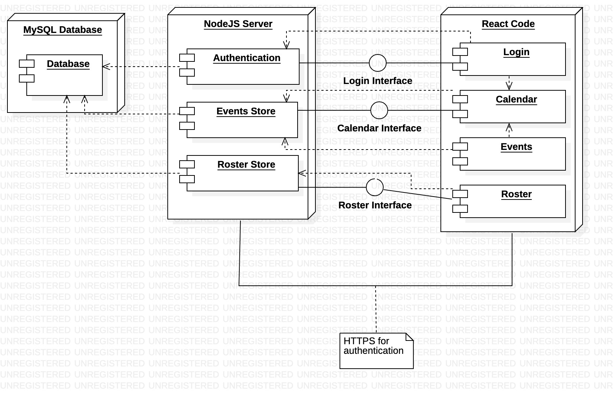

# CSC308-Club-Sports

---

## Setting up the codebase:

`git clone {github link}`

`npm run install-both` to install npm dependencies for frontend and backend

&nbsp;&nbsp;&nbsp;&nbsp;Alternatively, you can run `npm i` in the root directory and `npm i` in the my-app directory.

### Running in dev

* `npm run dev ` to run both frontend and backend, access the site at http://localhost:3000

* `npm start `to run just backend

* `npm run client ` to run just frontend

### Running production build

* First, run `npm build` in the `my-app` directory

* Then, you can run the production build through `npm start` and visiting http://localhost:5000

Contact achaussa@calpoly.edu for database and password encryption information to fill out envrionments variables

&nbsp;&nbsp;&nbsp;&nbsp;Alternatively, you can access envrionment variables through GitHub repo Secrets

---

## Style Guide:
https://github.com/airbnb/javascript

`npm run get-report ` to generate an html static code analysis report, saved in `report-output.html`

You can find a screenshot of the most updated report in the repo's GitHub wiki

---

## Tests:

Tests are run on a test database, seperate from the production database being used on the Heroku deployment

Unit tests are written using Jest, and stored in the `__jest__` folder

Acceptance tests are written using Cypress and the Cucumber plugin, and are stored in the `cypress/integration` folder

`npm run test:jest ` will run the jest tests in the proper folder and provide a coverage report

`npm run test:cy ` will run launch the server and run the cypress acceptance tests

`npm run test ` will run the above two commands

You can find a screenshot of the unit test coverage in the repo's GitHub wiki

---

## Continuous Integration:

We are using Travis CI for this project

https://travis-ci.com/github/adrien-chaussabel/CSC308-Club-Sports

---

## Deployment:

Deployed using heroku on: https://club-sports-hub.herokuapp.com/

---

## Prototype:

https://www.figma.com/file/rwvDW4MBXvO3duub7Jva10/Club-Sports?node-id=0%3A1

---

## System Architecture (Feb 7 Class Assignment)

